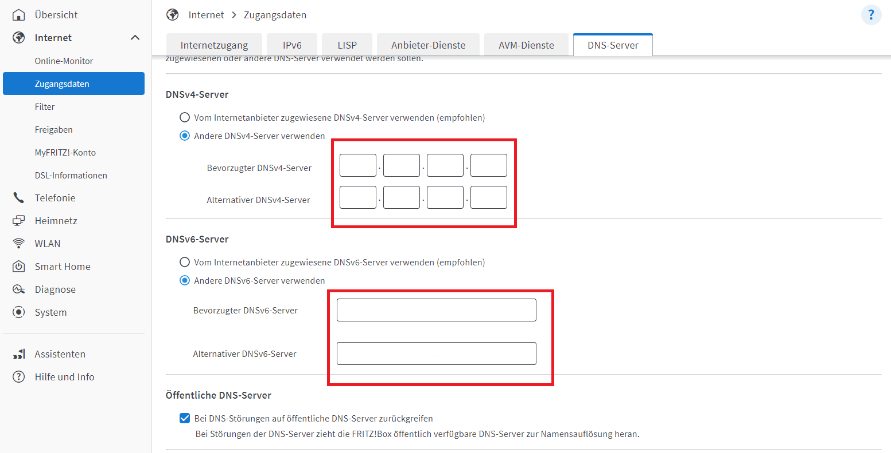
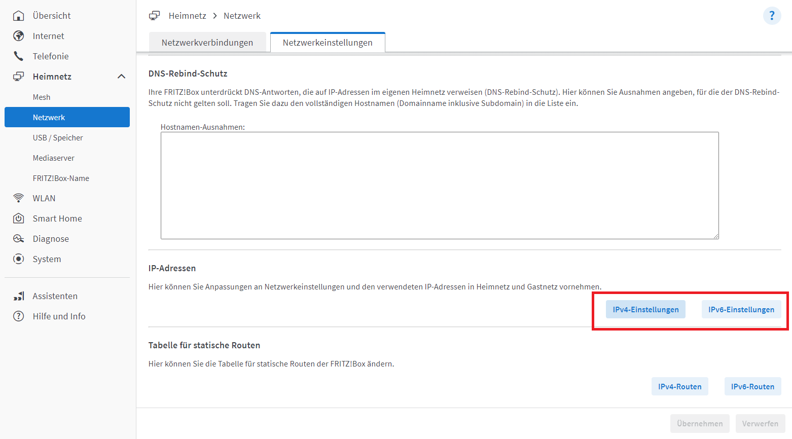
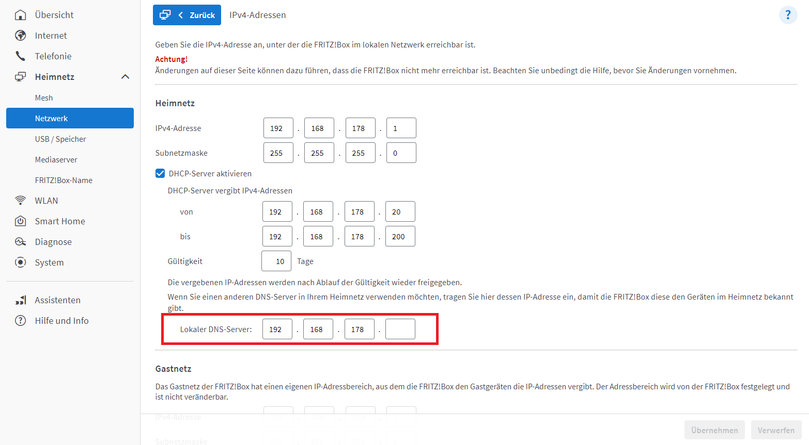
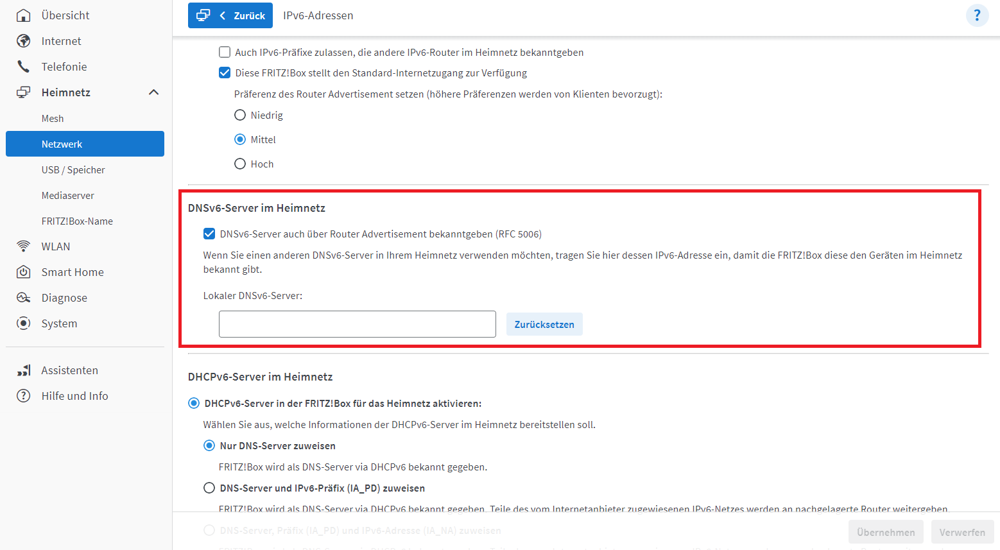
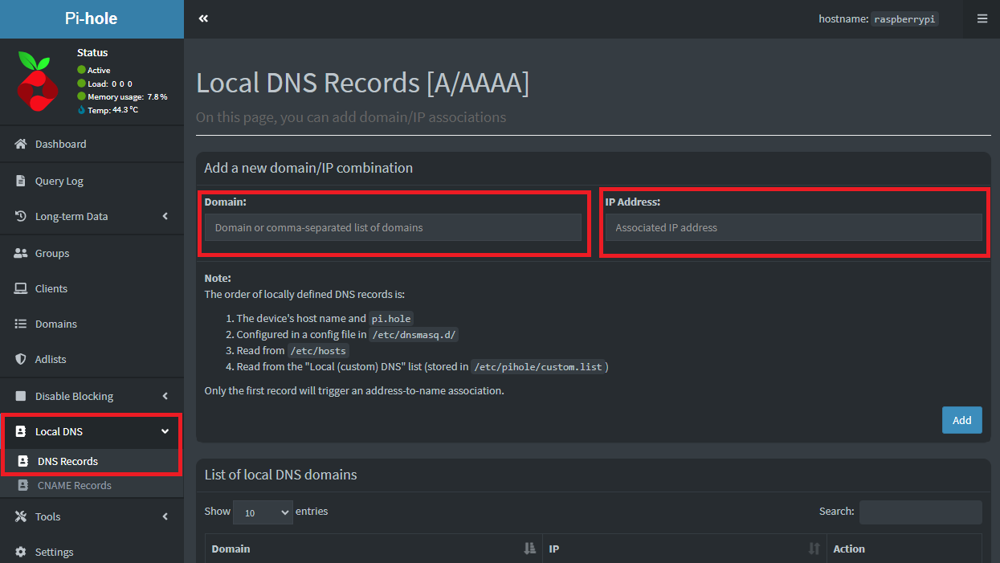
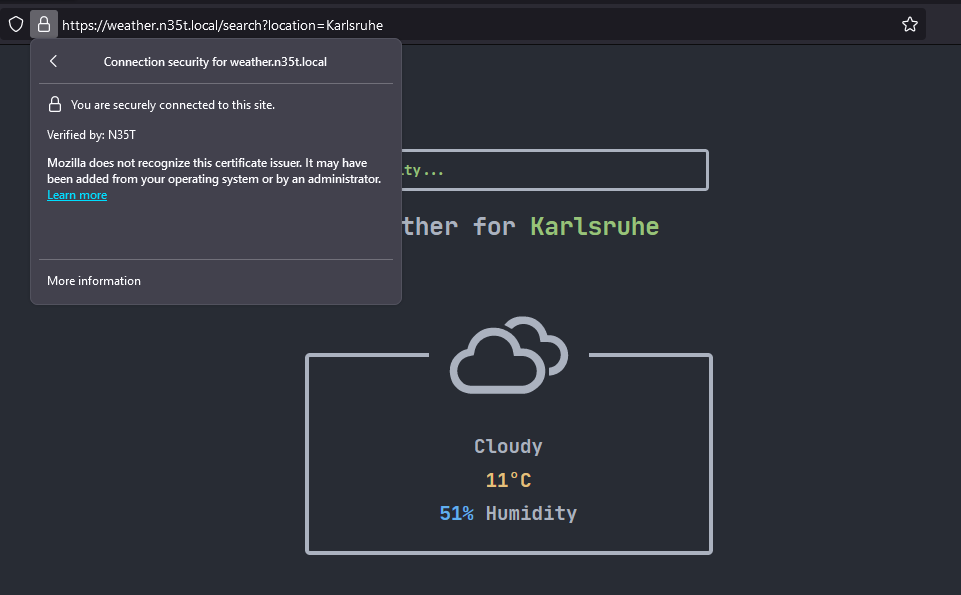

# PrivateCA
A software suite, used to manage our private certification authority for SSL certificates in our local network

To get started issuing your own certificates, there are only a few steps:
- [DNS Setup](#dns-setup)
- [Server Setup](#server-setup)
- [Creating your CA](#creating-your-ca)
- [Issuing Certificates](#issuing-certificates)
- [Trusting the Certificates](#trusting-the-certificates)

## DNS Setup
In order to have custom domain names without having to access a public domain, you will have to setup your own DNS server.

This is possible with a [Pi-hole](https://github.com/pi-hole/pi-hole) for example. The Pi-hole gives you the extra advantage of also having network-wide ad blocking.

It can be installed on a Linux hardware with the following one line command:

```bash
curl -sSL https://install.pi-hole.net | bash
```
From there, you will be guided through the installation process of the Pi-hole.

Once the installation is done you will need to login on your router first and configure the Pi-Hole as the preferred DNS-Server. On one side for the internet access: <br>
Here you have to enter the IP-address of your Pi-Hole (both IPv4 and IPv6).



Similar goes for the IP-address-configurations for your home network, so other devices know where to ask for resolving your local domains: 



### IPv4



### IPv6



> **Note:** There are different router types, with different interfaces. In this example we will be using a Fritz-Box. If you have a different router, the configurations might be located differently.

After configuring your router you can go to the web-interface of your Pi-hole and add your local domain records. Simply go to `Local DNS` and `DNS Records` on the side nav. Here you can add your local domain and link it to the IP-address of your local server.



Now when you enter the url of your local domain the Pi-Hole connects you with your local server. 

## Server Setup
HTTP and HTTPS communicates on port 80 and 443 by default. This means that regularly, only a single process can on the machine can serve a website on one of those ports.

Domains can only be pointed to an ip address and default to port 80 when `http://` or port 443 when `https://` is used. This rules out using different ports to expose different services!

To solve this problem you can use a simple proxy like [NGINX](https://docs.nginx.com/nginx/admin-guide/web-server/). This listens to requests on port 80/443, looks at the incoming domain of the request and routes it to the corresponding port of the service.

Example: Service1 running on port 5001, Service2 running on port 5002

Our service creates a file at `/etc/nginx/sites-enabled/service1.yourdomain.local.conf` configuring the proxy to forward the request to service1 based on the requested domain.

## Creating your CA

Before issuing your first certificates, you need to create your CA.
You need to build and install the PrivateCA client.

Now run `privateca`, choose `Create your own Certification Authority` and follow the dialog. 

[Demo Video on how to set up a local CA](https://github.com/N35T/PrivateCA/assets/61502536/74eb768b-adf9-4b55-9eeb-b99a43c4334d)

> **Note**: The inputs should match your `appsettings.json` 

## Issuing Certificates

To issue certificates and register a domain for your service you need:
- Your local DNS entries set via your PiHole
- Your local Service running on a free port
- The PrivateCA Api is set up and running
- The PrivateCA Api url is baked into the client
- The PrivateCA Client built and installed

Now run `privateca` and follow the dialog.

After that, NginX was successfully configured to forward traffic to your domain to the service's port and a SSL certificate was generated and signed by the CA.

Your service should now be reachable and secured via a SSL certificate.

[Demo Video on how to register a domain](https://github.com/N35T/PrivateCA/assets/61502536/1dfe35e6-3a90-4f1a-b86a-ba37280fdcdd)



## Trusting the Certificates

To continue, get your `example.ca.crt` file from your Certification Authority.

### Windows
To install the certificate on windows, right click the `.crt` file and choose `Install Certificate`.

When prompted for the Certification Store, choose `Place all certificates in the following store`.
Choose `Trusted Root Certification Authorities store` for the certificate.

You can learn more about this process [here](https://learn.microsoft.com/en-us/skype-sdk/sdn/articles/installing-the-trusted-root-certificate)!

Restart your browser and enjoy your SSL.

### Linux

Copy your certificate in the `ca-certificates` folder with
```bash
sudo cp example.ca.crt /usr/local/share/ca-certificates
```

And then update your ca certs
```bash
# IF not installed:
sudo apt-get install -y ca-certificates


sudo update-ca-certificates
```

See [here](https://ubuntu.com/server/docs/security-trust-store) for more information
